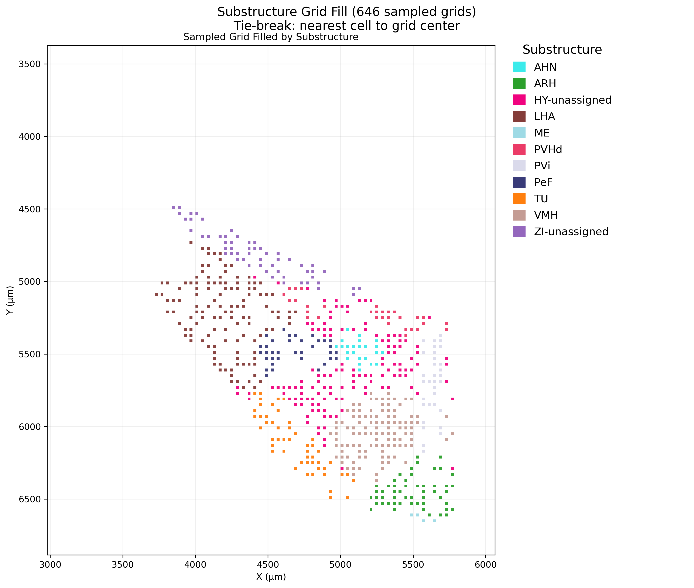
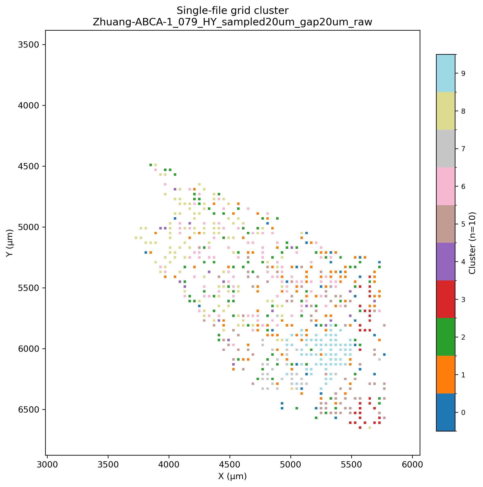

# MERFISH to DBiT Pipeline

This folder provides a master controller to run the full pipeline end-to-end:

1. Step 1: `ccf_registration_to_image.py`  
   (CCF visualization + grid sampling + sampled h5ad export)
2. Step 2: `cluster_sampled_h5ad.py`  
   (grid-level aggregation + Leiden clustering + single/merged outputs)

Master entry point: `run_merfish_pipeline.py`

---

## 1. Environment Setup


### Conda (recommended for this workspace)

```bash
conda create -n merfish-dbit python=3.12 -y
conda activate merfish-dbit
pip install numpy pandas matplotlib scipy scikit-learn anndata scanpy abc-atlas-access h5py
```

### Quick dependency check

```bash
python -c "import anndata, scanpy, abc_atlas_access, sklearn, matplotlib, pandas, numpy, scipy; print('OK')"
```

---

## 2. Quick Start

From script directory:

```bash
python run_merfish_pipeline.py \
  --download-base /path/to/download
  --datasets MERFISH_dataset
```

By default, this runs both steps with the built-in defaults.

---

## 3. Input/Output

### Step 1 (default)
- Input base: `<download-base>`
- Output root: `<download-base>/../output`
- Main outputs:
  - `sampling_images/`
  - `sampling_mask/`
  - `sampled_h5ad/`
  - `sampling_stats_*.txt`

### Step 2 (default)
- Input: `<download-base>/../output/sampled_h5ad`
- Output: `<download-base>/../output/cluster_results`
- Main outputs:
  - `single_h5ad/`
  - `single_grid_png/`
  - `merged_h5ad/`
  - `merged_grid_png/`
  - `reports/single_clustering_report.csv`
  - `reports/merged_clustering_report.csv`

### Results
<p align="center">
    <a href="docs/image/cell.png">
        
    </a>
    <a href="docs/image/grid.png">
        
    </a>
</p>

<p align="center">
    <sub>Left: Sampling results | Right: Cluster (click images for full size)</sub>
</p>

---

## 4. Common Commands

### 4.1 Run full pipeline (HY, 20/20 sampling)

```bash
python run_merfish_pipeline.py \
  --download-base /path/to/download
  --datasets MERFISH_dataset
  --division HY \
  --grid-block-um 20 \
  --grid-gap-um 20 \
  --leiden-resolution 1.0 \
  --leiden-n-neighbors 15
```

### 4.2 Run only Step 2 (reuse existing sampled_h5ad)

```bash
python run_merfish_pipeline.py \
  --skip-step1 \
  --download-base /path/to/download
```

### 4.3 Run only Step 1

```bash
python run_merfish_pipeline.py \
  --skip-step2 \
  --download-base /path/to/download
```

### 4.4 Dry-run (print commands only)

```bash
python run_merfish_pipeline.py \
  --download-base /path/to/download \
  --dry-run
```

---

## 5. Key Parameters (Master Script)

### Global
- `--python-exe`: Python executable used to launch sub-scripts
- `--scripts-dir`: script directory (defaults to current file location)
- `--skip-step1` / `--skip-step2`: skip a step
- `--dry-run`: print commands without execution

### Step 1
- `--download-base`
- `--datasets`
- `--division` (e.g. `HY` or `ALL`)
- `--grid-block-um` / `--grid-gap-um`
- `--expression-matrix-kind` (`raw` / `log2`)
- `--step1-show-sampling-grid` / `--step1-hide-sampling-grid`
- `--step1-export-sampled-h5ad` / `--step1-no-export-sampled-h5ad`
- `--step1-export-sampling-mask` / `--step1-no-export-sampling-mask`

### Step 2
- `--cluster-input-dir` / `--cluster-output-dir`
- `--cluster-input-glob`
- `--leiden-resolution`
- `--leiden-n-neighbors`
- `--embedding-dim`
- `--normalization` (`none` / `log1p_cpm`)
- `--grid-aggregate` (`sum` / `mean`)

---


## 6. Notes

- Step 2 groups samples automatically using relative paths under `--cluster-input-dir`.
- If you changed Step 1 output locations, explicitly set `--cluster-input-dir`.
- Keep `grid-block-um / grid-gap-um` consistent across both steps to ensure geometric alignment.

---

## Attribution

This project utilizes data from the **Allen Brain Cell Atlas (ABC Atlas)**. 

- **Data Source:** Allen Institute for Brain Science ([Link](https://alleninstitute.github.io/abc_atlas_access/intro.html)).
- **Access Tool:** We use the [abc_atlas_access](https://github.com/AllenInstitute/abc_atlas_access) library. (manifest version = 20260228)
- **License Note:** Data is provided under the Allen Institute Terms of Use. Please cite the primary ABC Atlas publication (Zhuang et al., 2023) when using this pipeline ([Link](https://alleninstitute.github.io/abc_atlas_access/descriptions/Zhuang_dataset.html)).